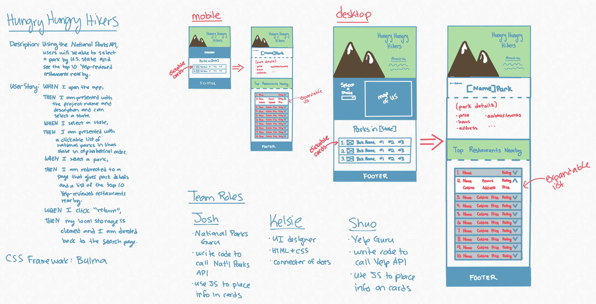

# Hungry Hungry Hikers

For this project, our team was tasked with creating a website that:
- uses at least 2 server-side APIs
- uses a CSS framework other than Bootstrap
- uses client-side storage to store persistent data
- has a mobile-first UI
- meets good quality coding standards (indentation, naming conventions, etc.)
- does NOT use alerts, confirms, or prompts
- is deployed to GitHub Pages
- is interactive

[See our live app](https://kelsie-c.github.io/national-parks/index.html)

**Please Note: ** This app uses Heroku to make the Yelp API calls. The first time you visit the site and select a park, you must open your console and click the link that directs you to Heroku where you must request temporary access. The site should then work when you refresh the page.

[See our project presentation](https://docs.google.com/presentation/d/19Boenw4lvCj53aU_1DpNeGzk6PujBN4b/edit#slide=id.p1)

## Our Concept

In the ideation stage, we decided to use the National Parks API and the Yelp API. By selecting a state and a national park, users will then be shown the 10 closest restaurants to their chosen park. 

## Skills Used

- HTML/CSS
- CSS Framework: Bulma
- Google Fonts
- JQuery
- JavaScript
- Local Storage
- National Parks API
- Yelp API
- Heroku

## Web App Preview

## Challenges

Our biggest challenge was sorting through all that the National Parks API had to offer. It has a ton of information and it took us a while to determine what pieces we wanted to use. 

The next challenge was getting the specific information from the National Parks API that the Yelp API needed in order to perform its search. We needed to store the park code and latitude/longitude in our local storage the same way each time. 

Our final challenge was making sure our site was responsive. Bulma was a new CSS Framework for us, but we found that it has a lot of built-in responsiveness that just required a little research for us to use.

## Future Development

We have some thoughts on how our app could be developed further:
- add a "favorites" button and page that allow users to save parks/restaurants
- add in more APIs to show users the nearest airports, hotels, and rental cars to provide a complete user experience
- add a social aspect where users can store/share their own images of state parks
- add a "challenges" feature that allows users to add goals and track progress. For example: visit # parks in a year, hike # trails in a given time frame, etc.

## Credits

- Wireframe created with Concepts App
- SVG map from Wikimedia Commons
- SVG mountain illustration from ManyPixels
- Presentation template from Slidesgo
- Images in presentation from Pexels